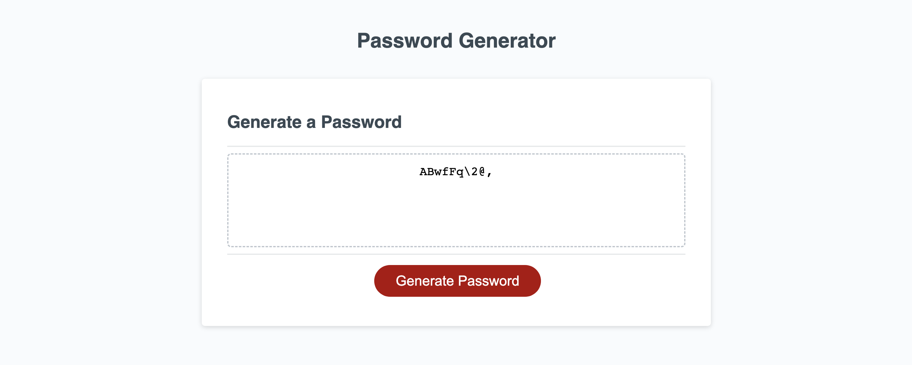
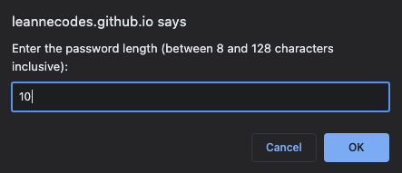
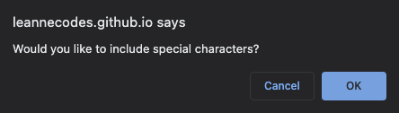
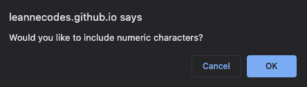
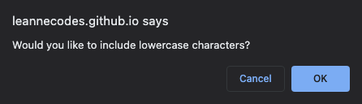
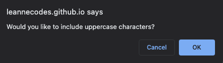
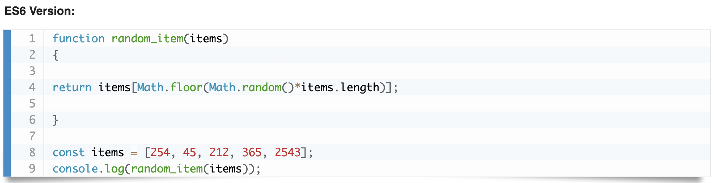
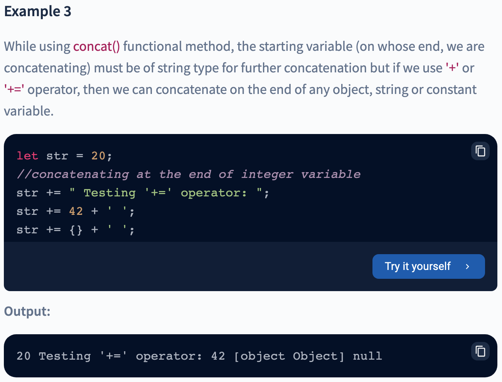
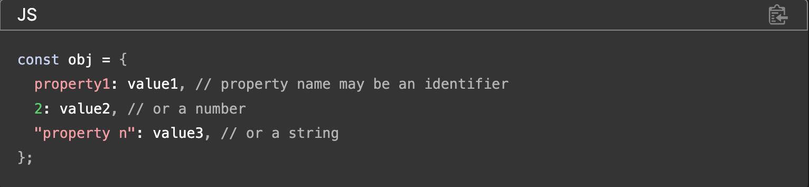
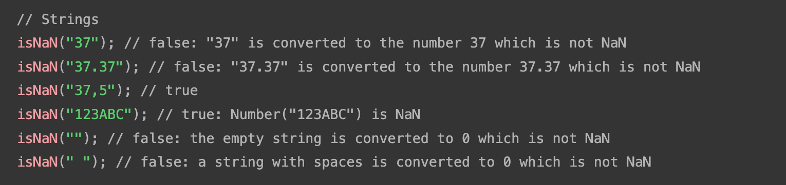

# Password Generator

Using a series of prompts and confirm functions to ask the user what they would like included in their password.

## Application Appearance

View live project [here](https://leannecodes.github.io/password-generator/).

## Usage

1. Click on "Generate Password" button.
2. Choose how many characters you want in your password. It must be a value between 8 and 128 inclusive.
   
3. Choose if you want at least one of the following:
   - special characters
     
     
   - numbers
     
     
   - lowercase letters
     
     
   - uppercase letters
     
     

   Please note: if you do not choose at least one option, it will not generate a password for you.

## Notes
I have included my console.logs throughout the code, to show my workings and to make sure I was on track to find the correct data.

## Credits
- W3Resource - used a function to help find a random item in an array. [Source](https://www.w3resource.com/javascript-exercises/javascript-array-exercise-35.php)

- Scaler - to help concatenate strings to form the password. [Source](https://www.scaler.com/topics/string-concatenation-javascript/)

- W3Schools and MDN web docs - to understand the structure on how I can store the confirm statements into a singular object. [W3Schools Source](https://www.w3schools.com/js/js_objects.asp#:~:text=Objects%20are%20variables%20too.,objects%20can%20contain%20many%20values.&text=The%20values%20are%20written%20as,objects%20with%20the%20const%20keyword) and [MDN Web Docs Source](https://developer.mozilla.org/en-US/docs/Web/JavaScript/Guide/Working_with_objects)

- MDN web docs - to understand the role of isNaN and how I can use it to determine if the user input is a number or not for the prompt. [Source](https://developer.mozilla.org/en-US/docs/Web/JavaScript/Reference/Global_Objects/isNaN)
